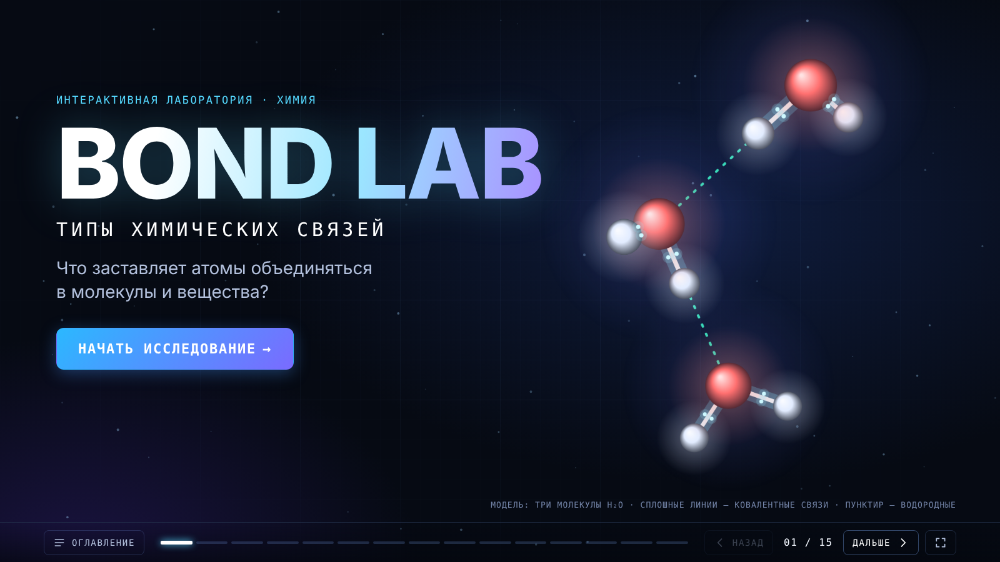
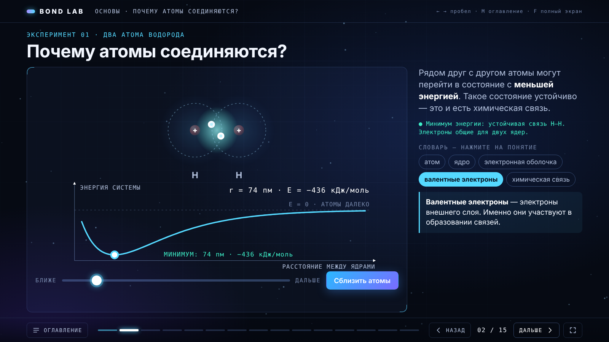
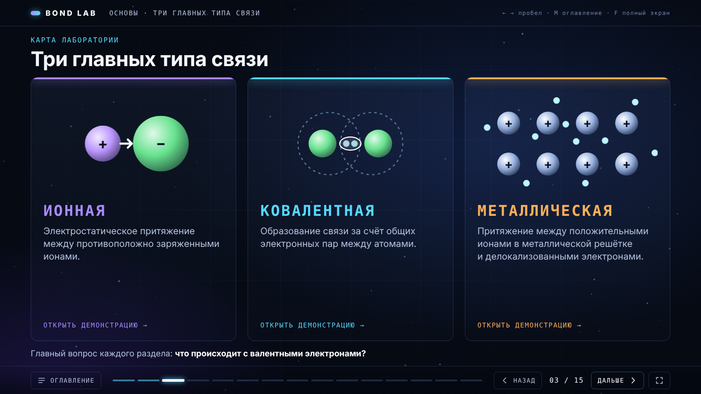
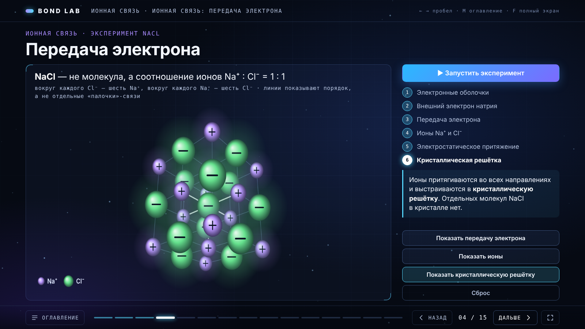
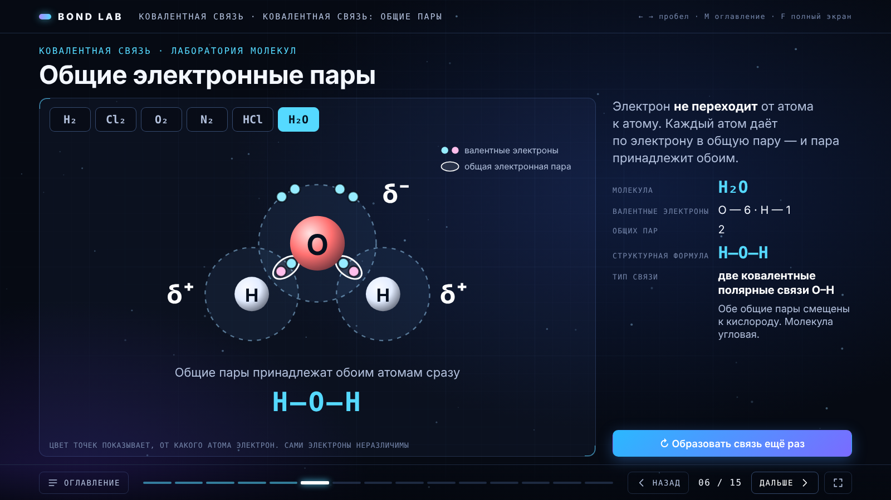
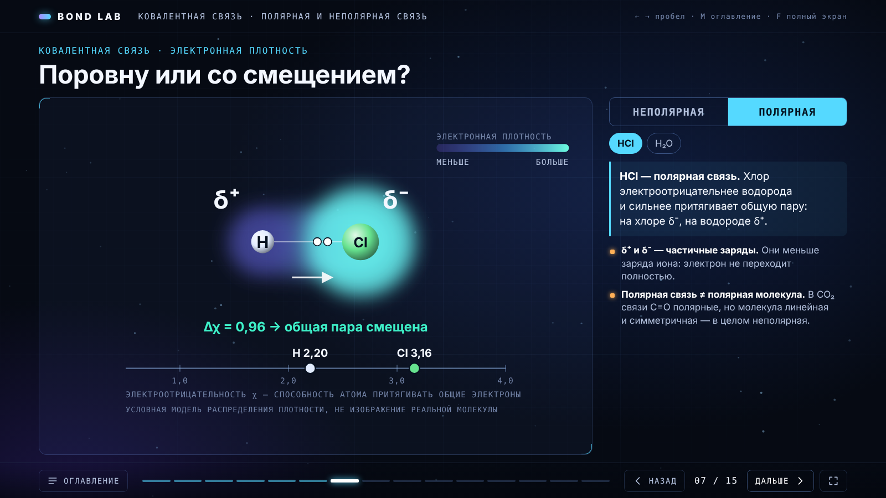
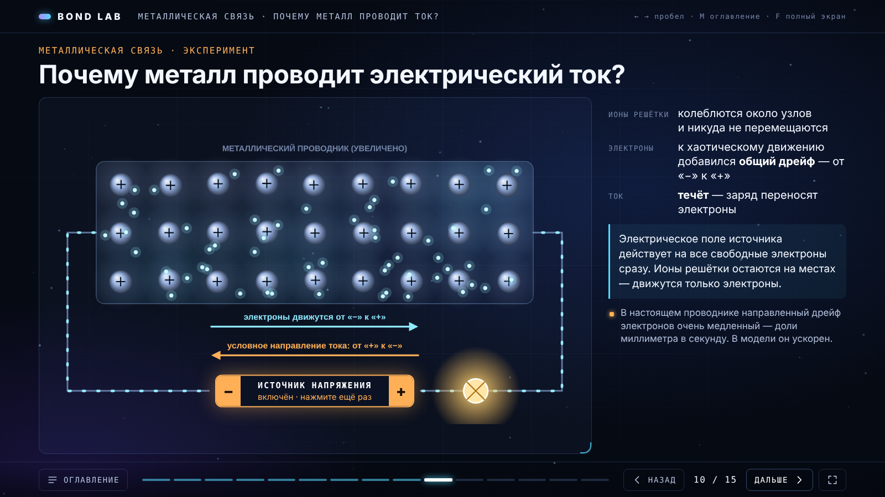
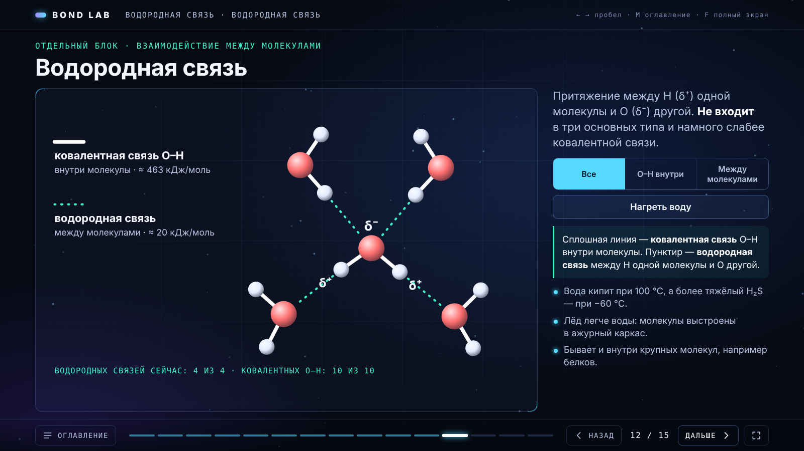
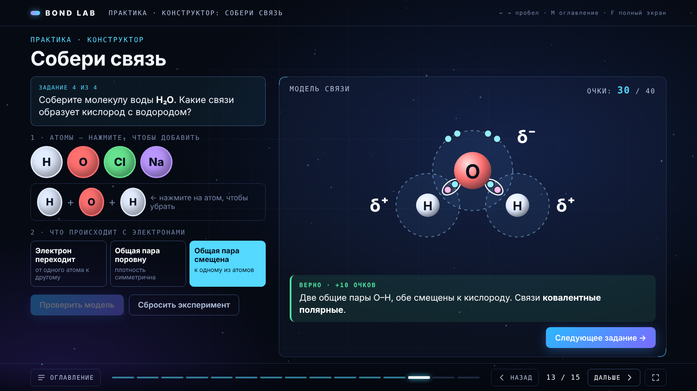
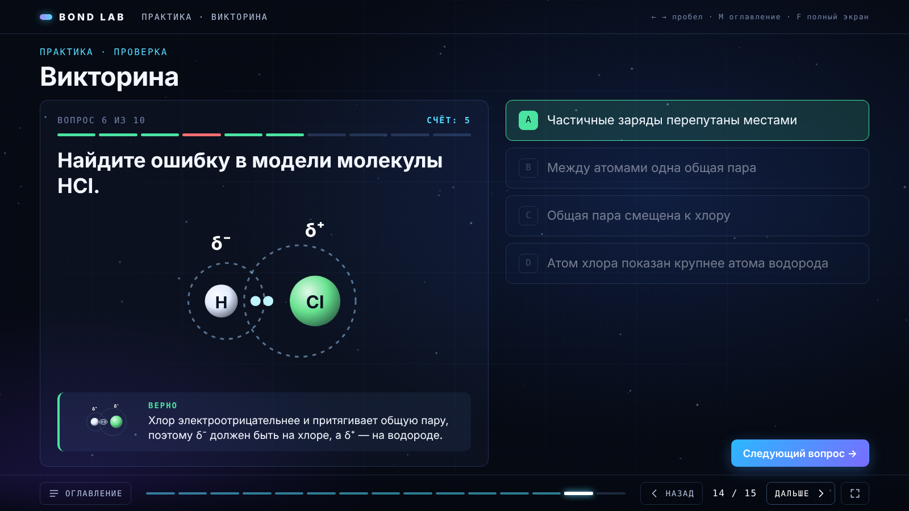

# BOND LAB

Интерактивная презентация по химии «Типы химических связей» в виде научной лаборатории: 15 экранов с анимированными моделями, конструктором связей и викториной.

Чистый HTML, CSS и JavaScript. Без библиотек, сборки и интернета: открывается двойным щелчком по `index.html`.



## Возможности

- **15 экранов** от устройства атома до итогов: ионная, ковалентная, металлическая и водородная связь.
- **Каждая анимация объясняет явление**: передачу электрона, образование общей пары, смещение электронной плотности, дрейф электронов в проводнике.
- **Конструктор «Собери связь»**: 4 задания, проверка модели, объяснение ошибок, очки.
- **Викторина на 10 вопросов**: выбор ответа, определение связи по модели, поиск ошибки, перетаскивание карточек.
- **Режим презентации**: сцена 16:9 масштабируется под любой экран, управление с клавиатуры и кликера, полноэкранный режим, оглавление, индикатор прогресса.
- **Работает офлайн**: ни одного внешнего запроса, системные шрифты.

## Скриншоты

| | |
|---|---|
|  Почему атомы соединяются: расстояние между ядрами и энергия системы |  Карта лаборатории |
|  Кристаллическая решётка NaCl |  Общие электронные пары |
|  Электронная плотность и электроотрицательность |  Почему металл проводит ток |
|  Водородные связи между молекулами воды |  Конструктор связей |



## Запуск

```bash
git clone https://github.com/Fegke12/bond-lab.git
```

Откройте `bond-lab/index.html` в браузере. Локальный сервер не нужен: скрипт подключён обычным `<script>`, без ES-модулей, поэтому всё работает по `file://`.

Открыть сразу нужный экран: `index.html#7` (номер от 1 до 15).

## Управление

| Клавиша | Действие |
|---|---|
| `→` `Пробел` `PageDown` | следующий экран |
| `←` `PageUp` `Backspace` | предыдущий экран |
| `Home` / `End` | первый / последний экран |
| `F` | полноэкранный режим |
| `M` | оглавление |
| `Esc` | закрыть оглавление или заметку |

Кликер для презентаций работает: он отправляет `PageDown` / `PageUp`.

## Структура проекта

```
bond-lab/
├── index.html          разметка всех 15 экранов и тексты
├── styles.css          оформление, сетка слайдов, анимации появления
├── app.js              навигация, рендереры моделей, сцены, конструктор, викторина
└── docs/screenshots/   скриншоты для README
```

### Экраны

| № | Экран | Интерактив | Технология |
|---|---|---|---|
| 1 | Титул | атомы собираются в три молекулы H₂O | Canvas, псевдо-3D |
| 2 | Почему атомы соединяются? | ползунок расстояния, кривая энергии, словарь понятий | SVG |
| 3 | Три главных типа связи | карточки ведут к демонстрациям | SVG + CSS |
| 4 | Ионная связь: передача электрона | эксперимент по шагам, ионы, решётка NaCl | SVG + Canvas |
| 5 | Свойства ионных соединений | кристалл / расплав / раствор, лампа в цепи | Canvas |
| 6 | Ковалентная связь | H₂, Cl₂, O₂, N₂, HCl, H₂O | SVG |
| 7 | Полярная и неполярная связь | переключатель, шкала электроотрицательности | SVG |
| 8 | Одинарная, двойная, тройная | карточки, сравнение энергий связи | SVG + CSS |
| 9 | Металлическая связь | теплопроводность, пластичность, блеск | Canvas |
| 10 | Почему металл проводит ток | источник напряжения включается щелчком | Canvas |
| 11 | Сравнение типов связи | подсветка строк и столбцов | CSS |
| 12 | Водородная связь | фильтр связей, нагрев воды | SVG |
| 13 | Конструктор «Собери связь» | 4 задания, 40 очков | SVG |
| 14 | Викторина | 10 вопросов, перетаскивание | DOM |
| 15 | Итог | результаты практики, заметка об упрощениях | Canvas + SVG |

## Как устроен код

### Сцена и масштабирование

Вся презентация живёт в блоке `#stage` размером 1600×900. Функция `fit()` масштабирует его через `transform: scale()` под окно, поэтому внутри можно верстать в пикселях, а страница никогда не прокручивается.

### `app.js` по разделам

Файл обёрнут в одну IIFE и разбит комментариями на восемь частей:

| Раздел | Что внутри |
|---|---|
| 1. Утилиты | хелперы DOM/SVG (`S`, `H`), твины (`tween`, `wait`, `cancelTweens`), таблица элементов `EL` |
| 2. Мини-иллюстрации | `icon(kind)`: маленькие SVG для карточек, таблицы и подсказок викторины |
| 3. Модель Льюиса | `MOL` (описания молекул) и `lewis(parent, key, opts)`, возвращает `set(p)`, где `p` от 0 до 1 |
| 4. Ионная решётка | `makeLattice(n)`, `drawLattice(...)`: вращающаяся решётка NaCl |
| 5. Модель металла | `MetalSim(ctx, opts)`: ионы в узлах, электроны, режимы `base`, `heat`, `bend`, `shine`, `current` |
| 6. Навигация | `go(i)`, клавиатура, оглавление, полноэкранный режим, фоновые частицы |
| 7. Сцены | по одной `scene(i, factory)` на экран |
| 8. Запуск | единый цикл `requestAnimationFrame` |

### Сцены

Каждый экран с логикой регистрируется так:

```js
scene(5, () => {
  // создаётся один раз, при первом показе экрана
  return {
    enter() {},       // экран открыт
    leave() {},       // экран закрыт
    tick(t, dt) {}    // каждый кадр, только пока экран активен
  };
});
```

Твины привязаны к владельцу-строке вида `'5:имя'`. При уходе с экрана `go()` вызывает `cancelTweens('5:')`, и незавершённые анимации останавливаются.

## Как изменить содержание

- **Тексты слайдов** лежат в `index.html`, пояснения к шагам анимаций — в объектах `TEXT` внутри сцен.
- **Вопросы викторины**: массив `Q` в `scene(13)`. Первый вариант в `o` всегда верный, порядок на экране перемешивается.
- **Задания конструктора**: массив `TASKS` в `scene(12)`; допустимые сочетания атомов и механизм связи — в `COMBO`.
- **Новая молекула**: добавьте запись в `MOL` (координаты атомов, неподелённые пары, связи и их кратность), и её сможет нарисовать `lewis()`.
- **Цвета и шрифты**: CSS-переменные в начале `styles.css`.
- **Новый экран**: добавьте `<section class="slide" data-sec="…" data-title="…">` в `index.html`. Оглавление, счётчик и прогресс построятся сами, но номера в `scene(i)` и `data-go` после вставки нужно сдвинуть.

## Научная корректность

Модели учебные и намеренно упрощённые, но не противоречат школьному курсу:

- NaCl показан как кристалл с соотношением ионов 1 : 1, а не как молекула.
- Частичные заряды δ⁺ / δ⁻ отделены от полных зарядов ионов.
- Полярность связи отделена от полярности молекулы.
- Водородная связь вынесена в отдельный блок и не смешивается с ковалентной.
- В металле движутся только электроны; ионы решётки остаются в узлах.
- Условные схемы подписаны, а на последнем экране есть заметка «Об упрощениях моделей».

Справочные значения, использованные в моделях:

| Величина | Значения |
|---|---|
| Энергия связи, кДж/моль | H–H 436 · O=O 498 · N≡N 945 · Cl–Cl 243 · O–H ≈ 463 |
| Длина связи, пм | H–H 74 · O=O 121 · N≡N 110 |
| Электроотрицательность по Полингу | H 2,20 · O 3,44 · N 3,04 · Cl 3,16 · Na 0,93 |

Перед использованием на уроке числа стоит сверить со школьным справочником.

## Совместимость

Проверено в Chromium. Используются только стандартные возможности: Canvas 2D, SVG, CSS Grid, Pointer Events и Fullscreen API. Для `overflow: clip` и `ctx.roundRect` в коде есть запасные варианты.
